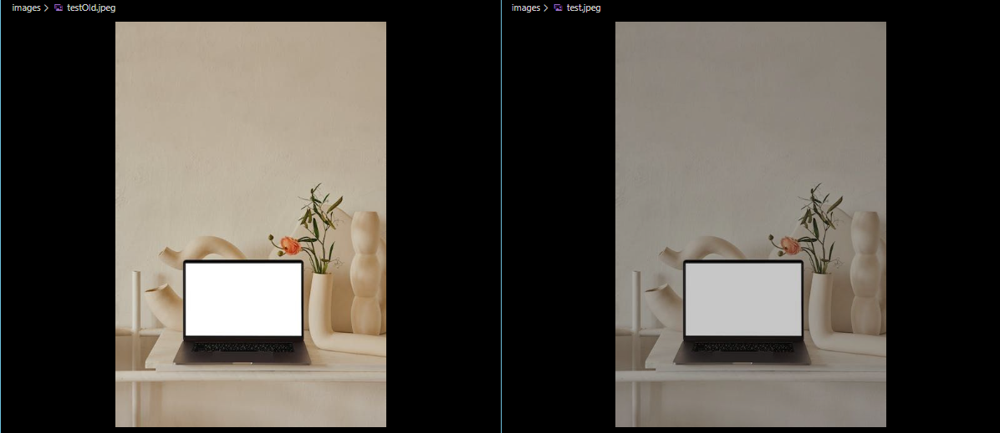

# Image Manipulation with Node.js

This Node.js project allows you to fetch images from the Pexels API, select a random image, and apply random filter to it using the Sharp library.

## Getting Started

To get started with this project, follow these steps:

1. Clone the repository to your local machine:

   ```bash
   git clone https://github.com/Djomlica/image_filtering__node
   cd image-manipulation

2. Install project dependencies:

npm install

Obtain a Pexels API Key:

Visit the Pexels website and sign up for a [free API key].(https://www.pexels.com/api)

Go into the config.js file and copy/paste the API key inside the apiKey.

3. Run the application:

This will fetch 10 images from the Pexels API, select one at random, and apply 10 different filters to it using the Sharp library.

**node index** in terminal

4. Change the keyword in index.js file into the main() function.

Some of the responses i get is this:



## Features
* Fetch 10 images from the Pexels API based on a keyword.
* Select a random image from the fetched images.
* Apply various filters to the selected image using the Sharp library.
* Experiment with different filter configurations by editing the code.

## Dependencies
* [Node.js](https://nodejs.org/en)
* [Axios](https://axios-http.com/docs/intro) - For making HTTP requests to the Pexels API.
* [Sharp](https://sharp.pixelplumbing.com/) - For image manipulation and applying filters.

## Configuration

You can customize the behavior of the image manipulation by editing the following variables in the app.js file:

API_KEY: Your Pexels API key.
KEYWORD: The keyword to search for on the Pexels API.
NUM_IMAGES_TO_FETCH: The number of images to fetch from the API.
FILTERS: An array of filter configurations to apply to the image.

Contributing
Contributions are welcome! Feel free to open an issue or submit a pull request to improve this project.